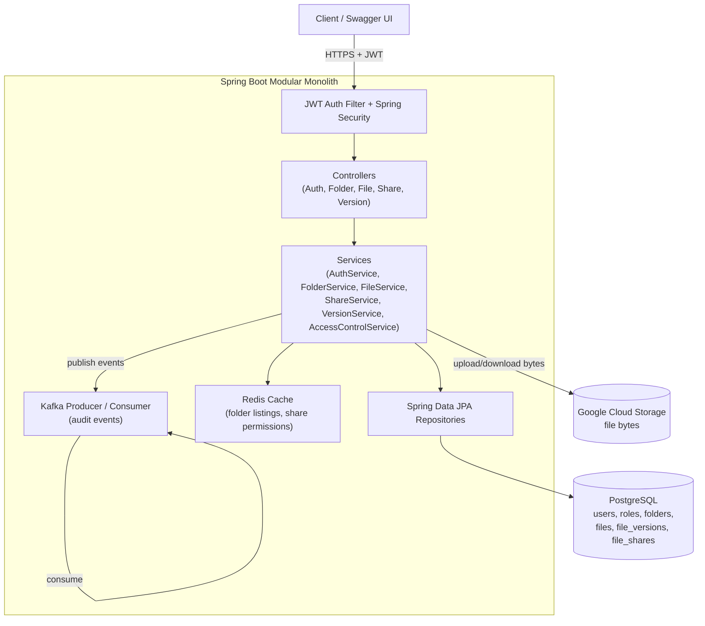
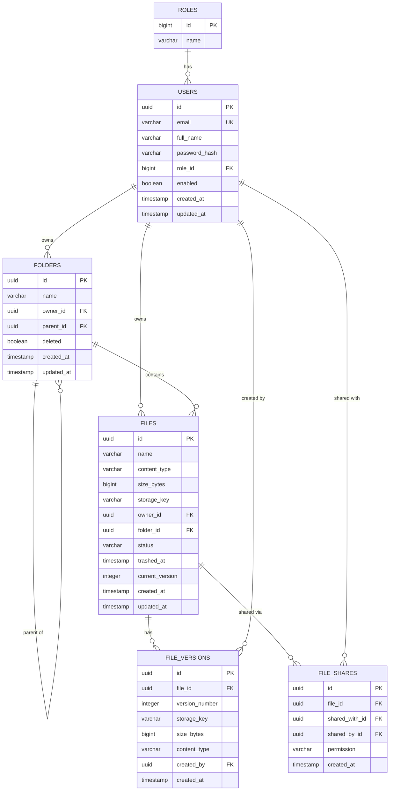

# Cloud File Storage & Document Management Backend

A production-style backend for cloud file storage and document management: folders,
file uploads/downloads via Google Cloud Storage, versioning, sharing with granular
permissions, trash/restore, search, and event-driven audit logging — built as a
single clean modular monolith.

## 1. Overview

Users register, organise files into nested folders, upload documents (stored in
GCS, metadata in PostgreSQL), share individual files with other users as
`VIEW` or `EDIT`, keep a full version history per file, and recover deleted
files from a trash bin before permanent deletion. Redis caches hot metadata
(folder listings, share permissions); Kafka carries domain events
(`FILE_UPLOADED`, `FILE_DELETED`, `FILE_SHARED`, `FILE_VERSION_CREATED`) to an
asynchronous audit listener so the request path is never blocked on downstream
processing.

## 2. Features

- **Auth**: register/login, JWT (HS256), BCrypt password hashing, `CUSTOMER`/`ADMIN` roles.
- **Folders**: create, list, rename, delete (recursive soft-delete), nested via self-referencing `parent_id`, strict per-owner isolation.
- **Files**: upload/download, rename, move, metadata, trash → restore → permanent delete, search/filter/sort/pagination.
- **GCS storage**: file bytes live only in GCS; PostgreSQL stores only the object key. Short-lived V4 signed URLs for direct download.
- **Sharing**: per-user `VIEW`/`EDIT` grants, update/revoke, strict ownership checks (only the owner manages shares).
- **Versioning**: every upload/re-upload creates an immutable version; list, download, and restore any prior version (restore creates a *new* version pointing at the old content — history is never destroyed).
- **Caching**: Redis caches folder listings and share-permission lookups only — never file bytes — with explicit eviction on writes.
- **Events**: Kafka topics for upload/delete/share/version-create, consumed asynchronously by an audit listener.
- **Security**: ownership + share-permission checks on every file/folder operation, content-type/size validation, sanitized error responses, no secrets in logs or Git.

## 3. Architecture



Layering is strict `Controller → Service → Repository`, with DTOs at the
boundary, constructor injection throughout, and a single `@RestControllerAdvice`
for centralised, safe error responses.

## 4. Entity-Relationship Diagram



## 5. Setup

### Prerequisites
- Java 21, Maven 3.9+
- Docker & Docker Compose
- A GCP project with a Cloud Storage bucket and a service-account JSON key (Storage Object Admin on that bucket)

### Local run (Docker Compose)
```bash
cp .env.example .env
# edit .env: set JWT_SECRET, GCS_BUCKET_NAME, GCS_CREDENTIALS_FILE (path to your key, outside the repo)

docker compose up --build
```
This starts PostgreSQL, Redis, Kafka (KRaft mode, no Zookeeper), and the app on `:8080`.
Flyway runs the schema migration automatically on startup.

### Run without Docker
```bash
export DB_URL=jdbc:postgresql://localhost:5432/cloudstore
export DB_USERNAME=cloudstore
export DB_PASSWORD=cloudstore
export JWT_SECRET=$(openssl rand -base64 48)
export GCS_BUCKET_NAME=your-bucket
export GOOGLE_APPLICATION_CREDENTIALS=/path/to/gcs-key.json   # ADC fallback, key never in the repo

mvn spring-boot:run
```

Swagger UI: `http://localhost:8080/swagger-ui.html`
Health check: `http://localhost:8080/actuator/health`

## 6. Docker / GCS configuration

- **Docker**: `Dockerfile` is a multi-stage build (Maven build stage → slim JRE runtime, non-root user). `docker-compose.yml` wires the app to Postgres, Redis, and Kafka; GCS stays external (real cloud service) and is only reached over the network with a mounted key file.
- **GCS credentials**: never committed. Supplied at runtime via (a) `GOOGLE_APPLICATION_CREDENTIALS` env var pointing at a mounted key file, (b) `app.gcs.credentials-location` pointing at a mounted resource, or (c) Application Default Credentials when running on GCP infrastructure. `.gitignore` excludes `*.json` credential-looking files and `.env`.
- **Signed URLs**: `GcsStorageService.generateSignedDownloadUrl` issues V4 signed URLs valid for 15 minutes (configurable via `GCS_SIGNED_URL_EXPIRY_MINUTES`), so clients can download directly from GCS without proxying bytes through the app for that use case, while `/download` also supports direct streaming through the API when needed.

## 7. Main APIs

| Method | Path | Description |
|---|---|---|
| POST | `/api/v1/auth/register` | Register a new CUSTOMER account |
| POST | `/api/v1/auth/login` | Login, returns JWT |
| POST | `/api/v1/folders` | Create folder (optionally nested) |
| GET | `/api/v1/folders?parentId=` | List folders under a parent (or root) |
| PATCH | `/api/v1/folders/{id}` | Rename folder |
| DELETE | `/api/v1/folders/{id}` | Delete folder (recursive soft-delete) |
| POST | `/api/v1/files` | Upload a file (multipart) |
| GET | `/api/v1/files/{id}` | File metadata |
| GET | `/api/v1/files/{id}/download` | Stream file content |
| GET | `/api/v1/files/{id}/signed-url` | Short-lived GCS signed download URL |
| PATCH | `/api/v1/files/{id}/rename` | Rename file |
| PATCH | `/api/v1/files/{id}/move` | Move file to another folder |
| DELETE | `/api/v1/files/{id}` | Move to trash |
| POST | `/api/v1/files/{id}/restore` | Restore from trash |
| DELETE | `/api/v1/files/{id}/permanent` | Permanently delete (must be trashed) |
| GET | `/api/v1/files?folderId=` | List files (paginated) |
| GET | `/api/v1/files/search?name=&contentType=` | Search/filter files |
| GET | `/api/v1/files/trash` | List trashed files |
| POST | `/api/v1/files/{id}/shares` | Share file with a user (VIEW/EDIT) |
| GET | `/api/v1/files/{id}/shares` | List a file's shares (owner only) |
| PATCH | `/api/v1/files/{id}/shares/{shareId}` | Update share permission |
| DELETE | `/api/v1/files/{id}/shares/{shareId}` | Revoke a share |
| GET | `/api/v1/shared-with-me` | Files shared with the current user |
| POST | `/api/v1/files/{id}/versions` | Upload a new version |
| GET | `/api/v1/files/{id}/versions` | List versions |
| GET | `/api/v1/files/{id}/versions/{n}/download` | Download a specific version |
| POST | `/api/v1/files/{id}/versions/{n}/restore` | Restore an old version (as a new version) |

Full interactive documentation is served via Swagger/OpenAPI at `/swagger-ui.html`.

## 8. Testing

```bash
mvn clean test
```

Tests use JUnit 5 + Mockito + Spring's test slices; the integration suite runs
against an in-memory H2 database (Flyway disabled, `ddl-auto=create-drop`), an
in-memory `CacheManager` in place of Redis, and an embedded Kafka broker — no
external services required to run `mvn test`.

- **Unit tests** (`service` package): `AuthService`, `AccessControlService`,
  `FileService`, `ShareService`, `VersionService` — ownership rules, share
  permission resolution (owner / VIEW / EDIT / no-access), versioning and
  restore semantics, trash lifecycle, all with mocked repositories.
- **Controller tests** (`controller` package): `AuthControllerTest` uses
  `@WebMvcTest` with a mocked service layer to verify request validation and
  HTTP status mapping.
- **Security integration test** (`integration/FileOwnershipSecurityIT`): a full
  `@SpringBootTest` that registers two real users, uploads a file as User A,
  and asserts User B gets `403 Forbidden` on read/download/rename/delete —
  and that access is granted only after an explicit `VIEW` share, and even
  then a `VIEW` share still cannot rename (owner/EDIT-only).

> Note: this response was produced by writing the full codebase directly; I
> was not able to execute `mvn clean verify` inside the authoring sandbox
> because outbound network access to Maven Central was blocked by the sandbox's
> egress policy, so dependencies could not be downloaded there. The code was
> written and reviewed carefully (including a structural brace/import check),
> but you should run `mvn clean verify` yourself after downloading the project
> to confirm a clean compile and test pass, and fix anything that surfaces.

## 9. Engineering decisions

- **Modular monolith over microservices**: the domain (auth, folders, files,
  sharing, versioning) is cohesive and doesn't yet need independent scaling or
  deployment — a single well-layered service is simpler to build, test, and
  operate correctly at this scope.
- **Metadata in PostgreSQL, bytes in GCS**: keeps the relational database small
  and fast, and lets GCS handle durability/scale for large binary content.
- **Restore-as-new-version**: version restore never deletes history — it
  appends a new version pointing at the old content, mirroring how Git revert
  works, so nothing is destructively lost.
- **Redis for metadata only, never file bytes**: caches folder listings and
  share-permission checks (read-heavy, small payloads) with short TTLs and
  explicit eviction on writes; large binary content is never cached.
- **Kafka for decoupled side-effects**: the audit listener demonstrates how
  additional consumers (search indexing, notifications) could be added later
  without touching the request path or existing services.
- **JWT stateless auth**: no server-side session store; horizontal scaling of
  the API layer doesn't require sticky sessions.

## 10. Limitations

- **Large-file uploads**: implemented as standard (non-chunked) multipart
  uploads, capped at 100MB at the application layer (`spring.servlet.multipart`
  + an explicit size check). True resumable/chunked upload (e.g. GCS resumable
  upload sessions or client-side multipart) is not implemented — this is the
  documented, practical limitation called out in the requirements rather than
  a partial/fragile implementation.
- **Single role per user**: `users.role_id` is a single FK (CUSTOMER or ADMIN),
  not a many-to-many role assignment — sufficient for the stated two-role
  requirement without over-engineering an RBAC system that isn't used.
- **No virus/malware scanning** of uploaded content — only content-type/size
  validation is performed.
- **No email verification** on registration.
- **Admin role** is modeled and enforced on `/actuator/**` as an example of
  role-gated access, but no dedicated admin management endpoints (e.g. user
  administration) are implemented — out of scope for the stated feature list.
- Performance and load-testing numbers are not included in this document, as
  none were actually measured; only the tests described in Section 8 were
  written.
